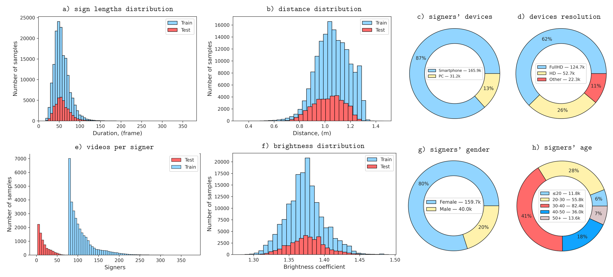

# Logos as a Well-Tempered Pre-train for Sign Language Recognition

This is an official code repository for the paper [Logos as a Well-Tempered Pre-train for Sign Language Recognition](https://www.arxiv.org/abs/2505.10481) and the Russian Sign Language dataset **Logos**.

## The Logos dataset


**Logos** is an extensive isolated Russian Sign Language dataset.
- 199,668 videos (80.7% in the train and 19.3% in the test sets);
- 2,863 unique glosses
- 381 signers of various age categories
- at least 720 pixels resolution, ~62% of videos are FullHD;
- 30 FPS;
- 221.4 hours total video duration;
- 104.7 hours representing the demonstration of signs themselves,  and the rest being fragments before and after the sign demonstration.

The key feature of the dataset is **annotated groups of glosses that differ only by non-manual components (VSSigns - Visually Similar Signs)**.
- 2,863 unique glosses are combined into 2,004 grouped VSSign classes with 35 to 737 samples per class.



The dataset is released to universities and research institutes for academic research purposes only.

**Instructions for obtaining the dataset will be added later.**


## The model

The model trained on the combination of Logos, AUTSL, and WLASL datasets can be downloaded by [the link](https://rndml-team-cv.obs.ru-moscow-1.hc.sbercloud.ru:443/datasets/logos/logos_autsl_wlasl_model.pth).

Model performance:

| Dataset      |  top-1 accuracy  |                       config                           |
| :----------: | :--------------: | :----------------------------------------------------: |
| Logos        |  0.9792          | [config](configs/Logos/logos_autsl_wlasl_init.py) |
| AUTSL        |  0.9781          | [config](configs/Logos/logos_autsl_wlasl_init_test_AUTSL.py) |
| WLASL        |  0.6682          | [config](configs/Logos/logos_autsl_wlasl_init_test_WLASL.py) |

Note that the configs differ only in the validation dataset used. The model is the same for all three datasets.


## Installation

This code is an extention for the [MMAction2 repository](https://github.com/open-mmlab/mmaction2).
You need to [install MMAction2](https://github.com/open-mmlab/mmaction2?tab=readme-ov-file#%EF%B8%8F-installation-) first and then apply changes from this repository to it.

### 1. Prepare an environement

```bash
conda create -n Logos python=3.11.5
conda activate Logos
conda install -y nvidia/label/cuda-12.1.0::cuda-toolkit -c nvidia/label/cuda-12.1.0
conda install -y libjpeg-turbo==3.0.0 -c conda-forge
```

### 2. Install mmaction2 with prerequisites

```bash
pip install torch==2.2.2 torchvision==0.17.2 --index-url https://download.pytorch.org/whl/cu121
pip install numpy==1.26.3 importlib_metadata einops==0.8.0 tensorboard==2.18.0 scikit-image==0.24.0
pip install h5py==3.12.1 albumentations==1.4.19
pip install -U git+https://github.com/lilohuang/PyTurboJPEG.git
pip install -U openmim
mim install mmengine==0.10.3
mim install mmcv==2.2.0
git clone https://github.com/open-mmlab/mmaction2.git
cd mmaction2
git checkout -b v1.2.0 4d6c93474730cad2f25e51109adcf96824efc7a3
pip install -v -e .
```

### 3. Install this repository code and prerequisites

```bash
git clone https://github.com/ai-forever/logos.git ../logos;
cp -RT ../logos/configs configs/; cp -RT ../logos/mmaction mmaction; cp -RT ../logos/tools tools; cp -RT ../logos/data data
```

### 4. Download the model
```bash
mkdir data/model
wget  -O data/model/logos_autsl_wlasl_model.pth https://rndml-team-cv.obs.ru-moscow-1.hc.sbercloud.ru:443/datasets/logos/logos_autsl_wlasl_model.pth
```

## Data preparation

# 1. Request the Logos dataset video data

- Request the data following the instructions [above](#the-logos-dataset);
- Unpack videos into the `data/Logos/videos` folder

# 2. Request and download AUTSL and WLASL datasets (optional)

To train or validate the model on the AUTSL and WLASL datasets, request the datasets from their publishers:
- [AUTSL](https://cvml.ankara.edu.tr/datasets/)
- [WLASL](https://dxli94.github.io/WLASL/)

For the WLASL dataset, you should download videos from the Internet and request videos that are unavailable from the dataset authors.

Both datasets' videos should be placed in the `data/AUTSL/videos` and `data/WLASL/videos` folders. Annotations should be transformed into `train.txt` and `test.txt` files with lists of video paths and class numbers, separated by space, with no headers:
```
data/AUTSL/train/signer0_sample1_color.mp4 41
data/AUTSL/train/signer0_sample2_color.mp4 104
data/AUTSL/train/signer0_sample3_color.mp4 205
...
```  
The files `train.txt` and `test.txt` for AUTSL and WLASL should be placed in the `data/AUTSL` and `data/WLASL` folders.

# 3. Data conversion

While the pipeline supports processing the original videos and annotation files, we use a preliminary conversion of the datasets to our native hdf5video format, which makes training and test processes several times faster.

To convert the Logos dataset, use the following command:

```bash
python tools/convert_to_hdf5video.py data/Logos/annotations/LOGOS_V5_FINAL_ANNOTATIONS_train.tsv data/Logos/logos_train_v2_jpg95_300.hdf5video  --format logos --num_workers 6 --video_root data/Logos/videos

python tools/convert_to_hdf5video.py data/Logos/annotations/LOGOS_V5_FINAL_ANNOTATIONS_test.tsv data/Logos/logos_test_v2_jpg95_300.hdf5video  --format logos --num_workers 6 --video_root data/Logos/videos
```

It will create data files `data/Logos/logos_train_v2_jpg95_300.hdf5video` and `data/Logos/logos_test_v2_jpg95_300.hdf5video`, that are used in the provided config files.

To convert AUTSL and WLASL datasets, use
```bash
python tools/convert_to_hdf5video.py data/AUTSL/train.txt data/AUTSL/autsl_train_jpg95_300.hdf5video --num_workers 6 --video_root data/AUTSL/videos

python tools/convert_to_hdf5video.py data/AUTSL/test.txt data/AUTSL/autsl_test_jpg95_300.hdf5video --num_workers 6 --video_root data/AUTSL/videos

python tools/convert_to_hdf5video.py data/WLASL/train.txt data/WLASL/wlasl_train_jpg95_300.hdf5video --num_workers 6 --video_root data/WLASL/videos

python tools/convert_to_hdf5video.py data/WLASL/test.txt data/WLASL/wlasl_test_jpg95_300.hdf5video --num_workers 6 --video_root data/WLASL/videos
```

## Training and Testing
For training and testing, follow the [instructions](https://mmaction2.readthedocs.io/en/latest/user_guides/train_test.html) provided in the official MMAction2 repository. Use the configuration files provided in this repository to train the models.

Training on the Logos dataset only, using 4 GPUs:
```
bash tools/dist_train.sh configs/Logos/logos_base.py 4
```

To train on the Logos, AUTSL and WLASL datasets using the Logos pretrain from the previous step either download the pretrained Logos-only moldel:
```bash
wget  -O data/model/logos_stage1_model.pth https://rndml-team-cv.obs.ru-moscow-1.hc.sbercloud.ru:443/datasets/logos/logos_stage1_model.pth
```
or modify `configs/Logos/logos_autsl_wlasl_init.py` to initialize model from the previous step instead of `data/model/logos_stage1_model.pth`. Then:
```
bash tools/dist_train.sh configs/Logos/logos_autsl_wlasl_init.py 4
```

Test on the Logos dataset:
```
bash tools/dist_test.sh configs/Logos/logos_autsl_wlasl_init.py data/model/logos_autsl_wlasl_model.pth 4
```

Test on the AUTSL and WLASL datasets:
```
bash tools/dist_test.sh configs/Logos/logos_autsl_wlasl_init_test_AUTSL.py data/model/logos_autsl_wlasl_model.pth 4

bash tools/dist_test.sh configs/Logos/logos_autsl_wlasl_init_test_WLASL.py data/model/logos_autsl_wlasl_model.pth 4
```

## Authors and Credits
- [Ilya Ovodov](https://www.linkedin.com/in/ilya-ovodov)
- [Petr Surovcev](https://www.linkedin.com/in/petros000)
- [Karina Kvanchiani](https://www.linkedin.com/in/kvanchiani)
- [Alexander Kapitanov](https://www.linkedin.com/in/hukenovs)
- [Alexander Nagaev](https://www.linkedin.com/in/nagadit)
  
## Citations
```
@article{ovodov2025logos,
  title={Logos as a Well-Tempered Pre-train for Sign Language Recognition},
  author={Ovodov, Ilya and Surovtsev, Petr and Kvanchiani, Karina and Kapitanov, Alexander and Nagaev, Alexander},
  journal={arXiv preprint arXiv:2505.10481},
  year={2025}
}
```
